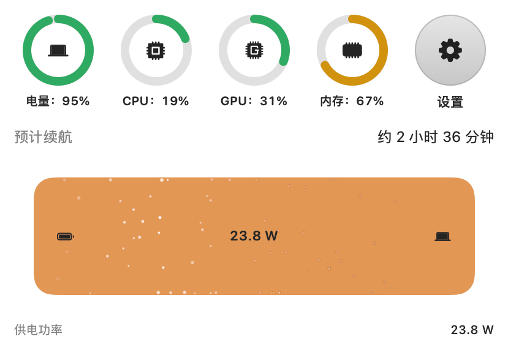
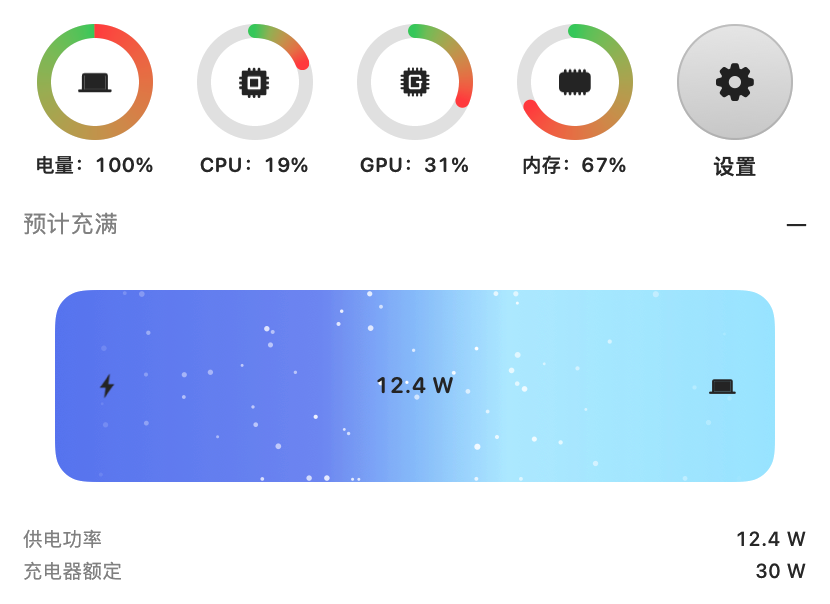
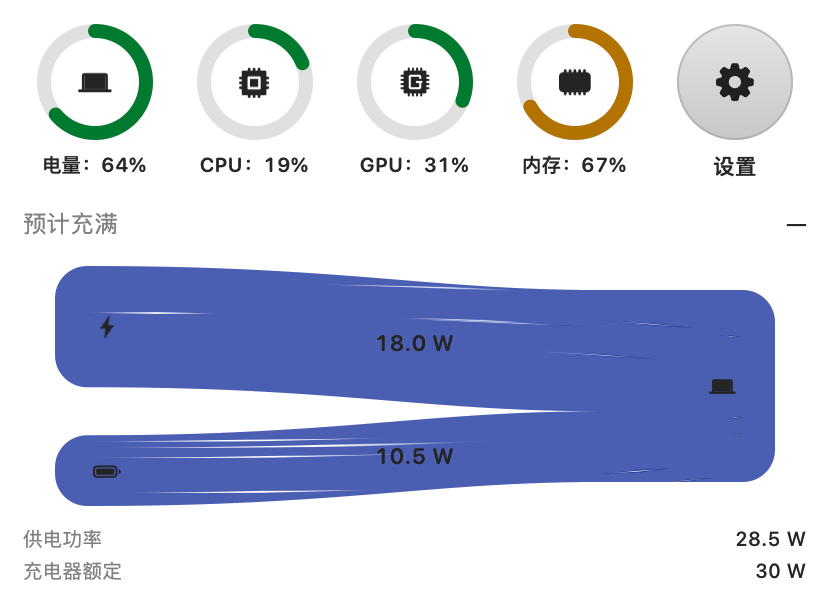
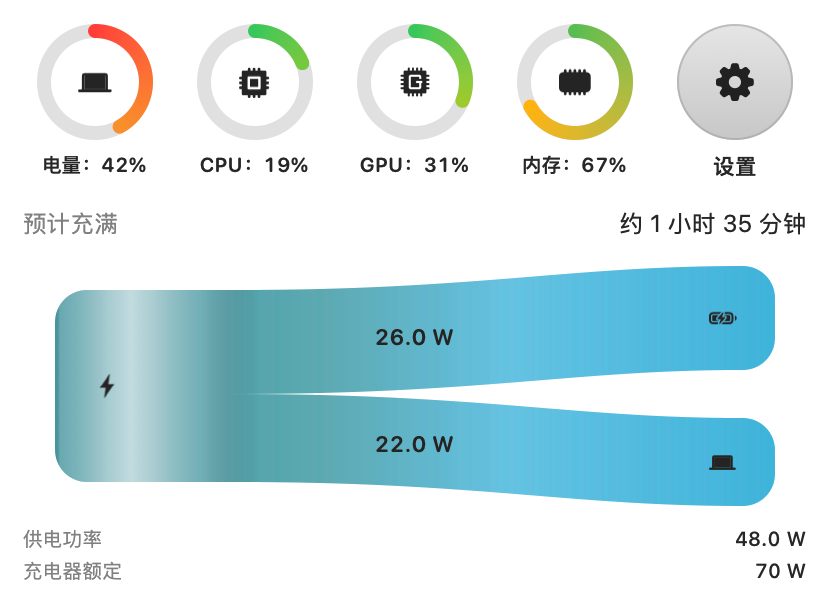
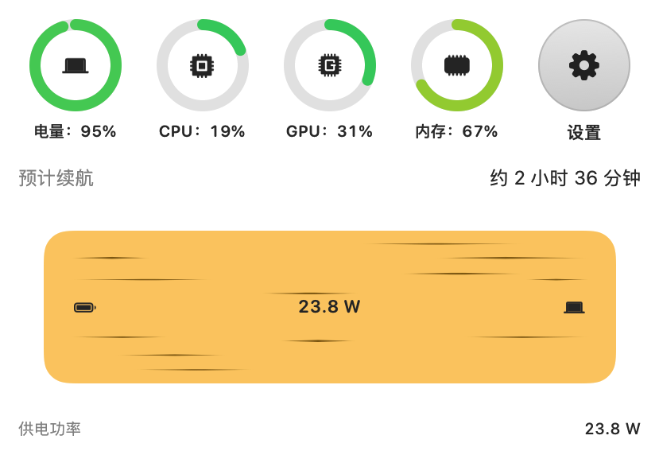
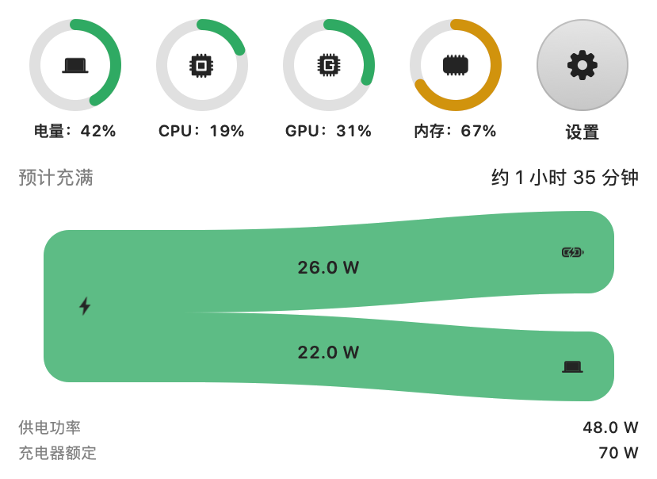

# MacPower

 ![LINUX DO](https://img.shields.io/badge/LINUX-DO-FFB003.svg?logo=data:image/svg%2bxml;base64,DQo8c3ZnIHhtbG5zPSJodHRwOi8vd3d3LnczLm9yZy8yMDAwL3N2ZyIgd2lkdGg9IjEwMCIgaGVpZ2h0PSIxMDAiPjxwYXRoIGQ9Ik00Ni44Mi0uMDU1aDYuMjVxMjMuOTY5IDIuMDYyIDM4IDIxLjQyNmM1LjI1OCA3LjY3NiA4LjIxNSAxNi4xNTYgOC44NzUgMjUuNDV2Ni4yNXEtMi4wNjQgMjMuOTY4LTIxLjQzIDM4LTExLjUxMiA3Ljg4NS0yNS40NDUgOC44NzRoLTYuMjVxLTIzLjk3LTIuMDY0LTM4LjAwNC0yMS40M1EuOTcxIDY3LjA1Ni0uMDU0IDUzLjE4di02LjQ3M0MxLjM2MiAzMC43ODEgOC41MDMgMTguMTQ4IDIxLjM3IDguODE3IDI5LjA0NyAzLjU2MiAzNy41MjcuNjA0IDQ2LjgyMS0uMDU2IiBzdHlsZT0ic3Ryb2tlOm5vbmU7ZmlsbC1ydWxlOmV2ZW5vZGQ7ZmlsbDojZWNlY2VjO2ZpbGwtb3BhY2l0eToxIi8+PHBhdGggZD0iTTQ3LjI2NiAyLjk1N3EyMi41My0uNjUgMzcuNzc3IDE1LjczOGE0OS43IDQ5LjcgMCAwIDEgNi44NjcgMTAuMTU3cS00MS45NjQuMjIyLTgzLjkzIDAgOS43NS0xOC42MTYgMzAuMDI0LTI0LjM4N2E2MSA2MSAwIDAgMSA5LjI2Mi0xLjUwOCIgc3R5bGU9InN0cm9rZTpub25lO2ZpbGwtcnVsZTpldmVub2RkO2ZpbGw6IzE5MTkxOTtmaWxsLW9wYWNpdHk6MSIvPjxwYXRoIGQ9Ik03Ljk4IDcwLjkyNmMyNy45NzctLjAzNSA1NS45NTQgMCA4My45My4xMTNRODMuNDI2IDg3LjQ3MyA2Ni4xMyA5NC4wODZxLTE4LjgxIDYuNTQ0LTM2LjgzMi0xLjg5OC0xNC4yMDMtNy4wOS0yMS4zMTctMjEuMjYyIiBzdHlsZT0ic3Ryb2tlOm5vbmU7ZmlsbC1ydWxlOmV2ZW5vZGQ7ZmlsbDojZjlhZjAwO2ZpbGwtb3BhY2l0eToxIi8+PC9zdmc+)    


中文 | [English](README.en.md)

MacBook 菜单栏电池监视器。不进 Dock，点开后是 **Liquid Glass** 监控面板：能量流向、系统圆环、续航或充满时间，外观与动效都可自定义。

## 预览


|                                                                       |                                                                                   |                                                                                       |
| --------------------------------------------------------------------- | --------------------------------------------------------------------------------- | ------------------------------------------------------------------------------------- |
|  **电池 → 电脑** · 粒子      |  **电源 → 电脑** · 渐变                 |  **电源 + 电池 → 电脑** · 细线 · 高对比 |
|  **电源 → 电池 + 电脑** · 滑动 |  **电池 → 电脑** · 柔和 · 细线 |  **电源 → 电池 + 电脑** · 无动效           |


## 功能

- 菜单栏 Liquid Glass 监控面板（能量流向、电量 / CPU / GPU / 内存圆环、续航或充满时间）
- 高度可自定义：配色预设、图标套装、动效样式、菜单栏电池外观等
- 不进 Dock；可选登录时启动、自动检查更新
- 多语言：简体中文、繁体中文、English、日本語、한국어、Français、Deutsch、Español、Português (Brasil)、Italiano、Русский（设置里可跟随系统或单独切换）


## 安装

### Homebrew

```bash
brew install --cask --no-quarantine ryanstarfox/tap/macpower
```

安装包是 ad-hoc 签名、未公证，所以要加 `--no-quarantine`。官方 `homebrew/cask` 不接收这类绕过 Gatekeeper 的应用，这里用的是个人 tap。

### 磁盘镜像

1. 从 [Releases](https://github.com/RyanStarFox/MacPower/releases) 下载最新的 `MacPower-*.dmg`，打开后把 **MacPower** 拖进 **应用程序**。
2. **修复损坏**（Release 为 ad-hoc 签名、未公证，下载后系统常会隔离）：

```bash
sudo xattr -rd com.apple.quarantine /Applications/MacPower.app
```

在「终端」中粘贴运行；输入密码时屏幕不会显示圆点，输完直接回车即可。
3. 打开 **系统设置 → 菜单栏**，确保允许 **MacPower** 在菜单栏中显示，然后从「应用程序」启动。

## 运行要求

- macOS 14 或更高（在 macOS 26+ 上使用 Liquid Glass；14/15 为材质回退）
- 带电池的 Apple 芯片 MacBook


## 从源码编译

```bash
brew install xcodegen
xcodegen generate
xcodebuild -project MacPower.xcodeproj -scheme MacPower -configuration Release -destination 'platform=macOS' build
```

重新制作 Release 磁盘镜像：

```bash
./scripts/make_dmg.sh
```

生成的 `.dmg` 在 `dist/`。

## 许可证

本项目采用 MIT License，并附加 Commons Clause。允许免费使用、修改和分发，但不得销售本软件，或通过主要依赖本软件功能的产品或服务获利。详见 [LICENSE](LICENSE)。

---

本开源项目已链接并认可 [LINUX DO 社区](https://linux.do)。